# Discovery Agent Hybrid Process Logic

## Simple Continuity

```mermaid
flowchart LR
  A["1. Click Dock App"] --> B["2. n8n receives webhook"]
  B --> C["3. Local Mac worker starts call capture"]
  C --> D["4. Audio chunks are transcribed"]
  D --> E["5. Transcript is finalized"]
  E --> F["6. CrewAI agents analyze the case"]
  F --> G["7. RAG retrieves similar cases"]
  G --> H["8. Local generator creates outputs"]
  H --> I["9. n8n stores/sends links"]
```

## Agentic Framework Vocabulary

| Component | Agentic Term | What It Means Here |
|---|---|---|
| Dock app | Human trigger / UI shell | A small macOS launcher that starts or stops the workflow. |
| n8n | Orchestrator | Coordinates systems, webhooks, notifications, retries, and storage. |
| Local worker | Runtime worker | A Python service on the Mac that can access local audio devices and files. |
| Audio capture | Deterministic tool | Non-LLM code that records chunks from the selected audio input. |
| Whisper | Transcription tool | Converts audio chunks into text. |
| Transcript buffer | Shared state | Accumulates transcribed text during the call. |
| CrewAI | Agentic framework | Coordinates specialist agents and exposes traces/observability. |
| Crew | Multi-agent workflow | The group of agents working sequentially on the transcript. |
| Agent | Role-based reasoning unit | A specialized role such as IntakeParser or SolutionArchitect. |
| Task | Work unit | A specific instruction assigned to an agent. |
| RAG | Retrieval-augmented generation | Finds similar cases before generating architecture/scope decisions. |
| Vector DB | Embedding search store | ChromaDB locally; CrewAI Knowledge in AMP. |
| Artifact generator | Deterministic output tool | Creates PDF, Markdown spec, and PM review files. |
| Human approval | Human-in-the-loop | The PM/client reviews outputs before sharing or implementation. |

## Why n8n + CrewAI Together

n8n is better for process automation: webhooks, triggers, storage, retries, notifications, and integration routing.

CrewAI is better for agentic reasoning: specialist agents, tasks, traces, LLM calls, and structured analysis.

The local Mac is necessary for live call capture because BlackHole, microphone/input routing, and local audio permissions live on the computer.
